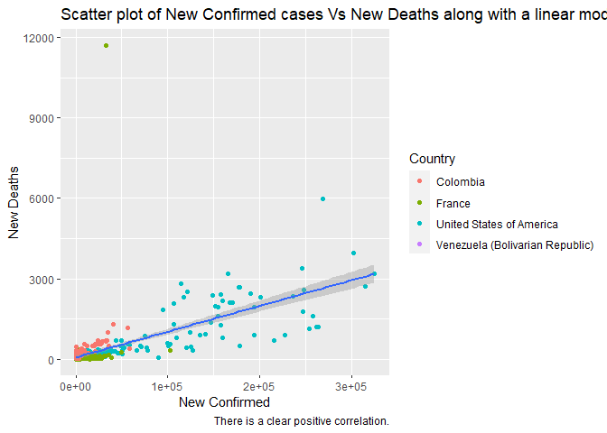
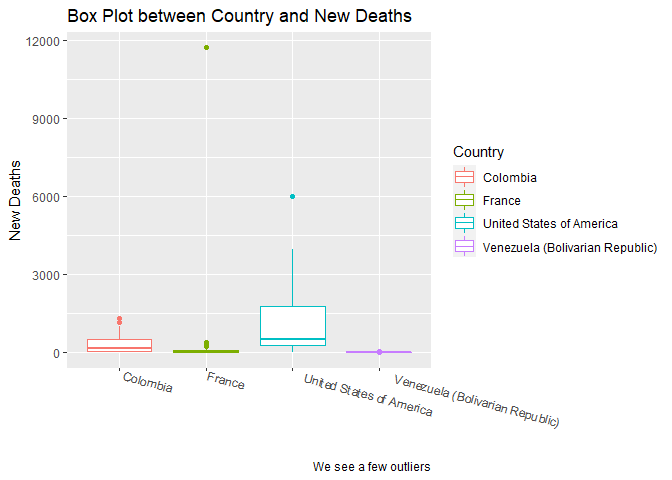
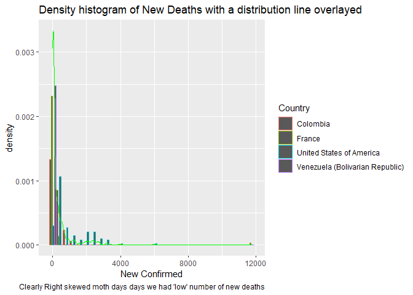
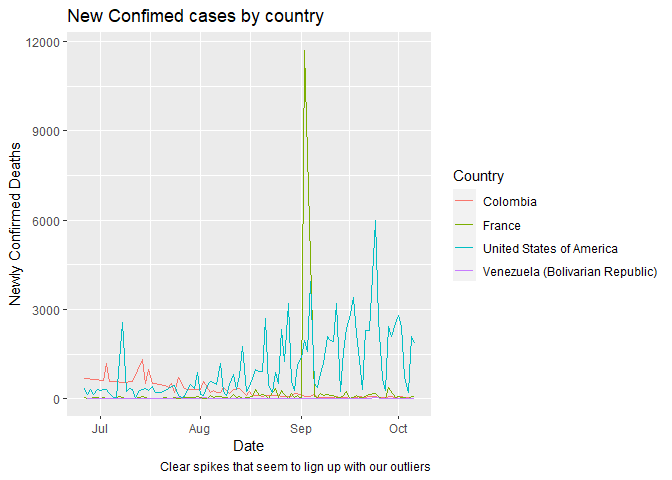
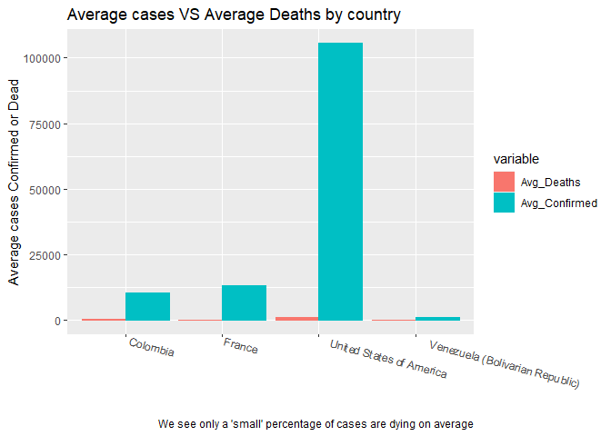

Sergio Mora ST 558 Project 1
================
Sergio Mora
10/2/2021

  - [1 Required Packages for this
    Vingette](#required-packages-for-this-vingette)
  - [2 Creating New Functions / Data
    Manipulation](#creating-new-functions--data-manipulation)
  - [3 Contingency Table](#contingency-table)
  - [4 Creating New Data Sets](#creating-new-data-sets)
  - [5 Numerical Summaries / Plots](#numerical-summaries--plots)

# 1 Required Packages for this Vingette

  - The `lubridate` for date manipulation
  - The `jsonlite` to pull date from API’s
  - The `tidyverse` to utilize infix functions such as `%>%`
  - The `countrycode` package to join the country of origin to the
    continent it belongs in
  - The `knitr` package to show our data in a way that is more appialing
  - The `reshape2` package to reshape my data. Although this can be
    achieved with pivot\_longer/pivot\_wider `reshape2` is easier to use

<!-- end list -->

``` r
library(lubridate)
library(jsonlite)
library(tidyverse)
library(countrycode)
library(knitr)
library(reshape2)
```

# 2 Creating New Functions / Data Manipulation

We are creating two functions:

  - `referrence_table_lookup()`: which lets us pull any countries covid
    data based on our input. This will be helpful if we want to loop
    through these countries to get similar analysis across the board.

  - `referrence_table_clean()`: which pulls in
    `referrence_table_lookup()` and cleans it up to how we want to see
    the data for our plots down below. We also create a few new
    variables which we will use for out Exploratory Data Analysis (EDA).

<!-- end list -->

``` r
referrence_table <- fromJSON(
    "https://api.covid19api.com/countries"
    )


# This gives us the continent that each country belong in. There are a few exception that this function does not count for, we will not acocunt for these manually since we are not looking at these individually and because my geography skills are awful.
referrence_table <- referrence_table %>% 
  mutate(continent = countrycode(sourcevar = referrence_table[, "Slug"], origin = "country.name", destination = "continent"))

#Creating a function to pull in any country data.
referrence_table_lookup <- function(x,type){
  country_clean <-   switch (type,
  Country = referrence_table %>% filter(Country == x) %>% select(Slug),
  Slug = referrence_table %>% filter(Slug == x) %>% select(Slug),
  ISO2 = referrence_table %>% filter(ISO2 == x) %>% select(Slug)
  )
  return(fromJSON(paste0("https://api.covid19api.com/live/country/",country_clean,"/status/confirmed"))
  )
}


referrence_table_clean <- function(x,type,date1 = "2021-01-01",date2 = "3000-01-01",NEW_DEATHS_MIN = 0,...){
  referrence_table_lookup(x,type) %>% 
  filter(Date >= as.Date(date1) & Date <= as.Date(date2)) %>% 
  group_by(Country,Date) %>% 
  summarise(sum_of_Confirmed = sum(Confirmed),sum_of_Deaths = sum(Deaths),sum_of_Active = sum(Active))  %>% 
  mutate(New_Confirmed = (sum_of_Confirmed - lag(sum_of_Confirmed)),New_Deaths = (sum_of_Deaths - lag(sum_of_Deaths)),New_Active = (sum_of_Active - lag(sum_of_Active)),Date = ymd_hms(Date)) %>%
  filter(New_Deaths > NEW_DEATHS_MIN)
}
names(referrence_table_clean("US","ISO2"))
```

    ## [1] "Country"          "Date"             "sum_of_Confirmed" "sum_of_Deaths"    "sum_of_Active"    "New_Confirmed"    "New_Deaths"       "New_Active"

# 3 Contingency Table

We want to see how many individual countries we have per continent. Due
to vast difference in population this doesn’t tell us a huge amount with
regards to any preditive models we could build but it’s nice to know.
There are a few terretories that are not accounted.

``` r
table(referrence_table$continent) %>% 
kable(col.names = c("Continent", "Frequency"))
```

| Continent | Frequency |
| :-------- | --------: |
| Africa    |        58 |
| Americas  |        52 |
| Asia      |        51 |
| Europe    |        50 |
| Oceania   |        25 |

# 4 Creating New Data Sets

Now that we have created two functions that will allow us to pull data
directly from the API for any country available we will now create a few
datasets to review. I live in the U.S. but I was born and raised in
Venezuela. For this reason I am currous how Venezuela compares to the
U.S. in covid cases. For good measure we will also through in France and
Colombia, these are countries that I have spent some time in growing up.
There is no need to further manipulate our data since we took care of
that in our functions above.

``` r
Full_data <- bind_rows(referrence_table_clean("US","ISO2"),referrence_table_clean("venezuela","Slug"),referrence_table_clean("France","Country"),referrence_table_clean("Colombia","Country"))

Full_data
```

    ## # A tibble: 375 x 8
    ##    Country                  Date                sum_of_Confirmed sum_of_Deaths sum_of_Active New_Confirmed New_Deaths New_Active
    ##    <chr>                    <dttm>                         <int>         <int>         <int>         <int>      <int>      <int>
    ##  1 United States of America 2021-06-26 00:00:00         33602388        603522      32998866         11928        347      11644
    ##  2 United States of America 2021-06-27 00:00:00         33610083        603664      33006419          7695        142       7553
    ##  3 United States of America 2021-06-28 00:00:00         33624624        603963      33020661         14541        299      14242
    ##  4 United States of America 2021-06-29 00:00:00         33639905        604111      33035794         15281        148      15133
    ##  5 United States of America 2021-06-30 00:00:00         33651211        604433      33046778         11306        322      10984
    ##  6 United States of America 2021-07-01 00:00:00         33664616        604711      33059905         13405        278      13127
    ##  7 United States of America 2021-07-02 00:00:00         33678118        605009      33073109         13502        298      13204
    ##  8 United States of America 2021-07-03 00:00:00         33692813        605309      33087504         14695        300      14395
    ##  9 United States of America 2021-07-04 00:00:00         33713521        605490      33108031         20708        181      20527
    ## 10 United States of America 2021-07-05 00:00:00         33716781        605523      33111258          3260         33       3227
    ## # ... with 365 more rows

# 5 Numerical Summaries / Plots

Because I don’t understand what negative new deaths means I will remove
them for this analysis.

``` r
g <- ggplot(Full_data)

g + geom_point(aes(x = New_Confirmed, y = New_Deaths, color = Country)) + 
  geom_smooth(aes(x = New_Confirmed, y = New_Deaths),method = "lm") + 
  labs(title = "Scatter plot of New Confirmed cases Vs New Deaths along with a linear model.", caption = "There is a clear positive correlation.") +
  ylab("New Deaths") + xlab("New Confirmed")
```

<!-- -->

``` r
g + geom_boxplot(aes(x = Country, y = New_Deaths, color = Country)) + 
  theme(axis.text.x = element_text(angle = -15,hjust = -.1)) + 
  labs(title = "Box Plot between Country and New Deaths", caption = "We see a few outliers") + 
  ylab("New Deaths") + 
  xlab("")
```

<!-- -->

``` r
g + geom_histogram(aes(x = New_Deaths, group = Country, color = Country, y = ..density..), position = "dodge") + 
  stat_density(aes(x = New_Deaths),geom = "line", color = "green") + 
  labs(title = "Density histogram of New Deaths with a distribution line overlayed", caption = "Clearly Right skewed moth days days we had 'low' number of new deaths") + xlab("New Confirmed")
```

<!-- -->

``` r
g + geom_line(aes(x = Date,y = New_Deaths, group = Country, color = Country)) + 
  labs(title = "New Confimed cases by country", caption = "Clear spikes that seem to lign up with our outliers") + 
  ylab("Newly Confirmed Deaths")
```

<!-- -->

``` r
Summary_data <- Full_data %>% 
  group_by(Country) %>% 
  summarise(Avg_Deaths = mean(New_Deaths, na.rm = TRUE), Avg_Confirmed = mean(New_Confirmed, na.rm = TRUE))

q <- ggplot(melt(Summary_data), aes(x = Country, y = value, fill = variable, color = variable))

q + geom_bar(stat = "identity", position = "dodge") + 
  theme(axis.text.x = element_text(angle = -15,hjust = -.1)) + 
  labs(title = "Average cases VS Average Deaths by country", caption = "We see only a 'small' percentage of cases are dying on average") + 
  ylab("Average cases Confirmed or Dead") + 
  xlab("")
```

<!-- -->
