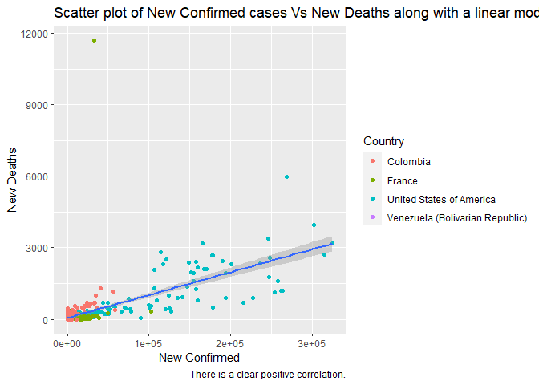
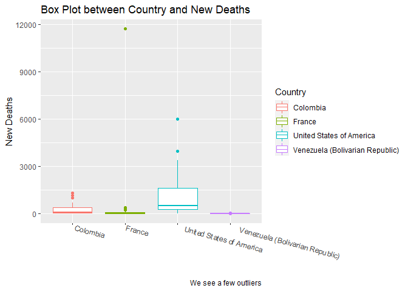

Sergio Mora ST 558 Project 1
================
Sergio Mora
10/2/2021

  - [Required Packages for this
    Vingette](#required-packages-for-this-vingette)
  - [Creating New Functions / Data
    Manipulation](#creating-new-functions--data-manipulation)
  - [Contingency Tables](#contingency-tables)
  - [Creating New Data Sets](#creating-new-data-sets)
  - [Numerical Summaries / Graphs](#numerical-summaries--graphs)

# Required Packages for this Vingette

  - The `lubridate` for date manipulation
  - The `jsonlite` to pull date from API’s
  - The `tidyverse` to utilize infix functions such as `%>%`
  - The `countrycode` package to join the country of origin to the
    continent it belongs in
  - The `knitr` package to show our data in a way that is more appialing

# Creating New Functions / Data Manipulation

We are creating two functions:

  - `referrence_table_lookup()`: which lets us pull any countries covid
    data based on our input. This will be helpful if we want to loop
    through these countries to get similar analysis across the board.

  - `referrence_table_clean()`: which pulls in
    `referrence_table_lookup()` and cleans it up to how we want to see
    the data for our plots down below.

<!-- end list -->

``` r
referrence_table <- fromJSON(
    "https://api.covid19api.com/countries"
    )


# This gives us the continent that each country belong in. There are a few exception that this function does not count for, we will not acocunt for these manually since we are not looking at these individually and because my geography skills are awful.
referrence_table <- referrence_table %>% mutate(continent = countrycode(sourcevar = referrence_table[, "Slug"], origin = "country.name", destination = "continent"))
```

    ## Warning in countrycode_convert(sourcevar = sourcevar, origin = origin, destination = dest, : Some values were not matched unambiguously: ala-aland-islands, antarctica, bouvet-island, british-indian-ocean-territory, cocos-keeling-islands, french-southern-territories, heard-and-mcdonald-islands, kosovo, micronesia, south-georgia-and-the-south-sandwich-islands, us-minor-outlying-islands, virgin-islands

``` r
#Creating a function to pull in any country data.
referrence_table_lookup <- function(x,type){
country_clean <-   switch (type,
    Country = referrence_table %>% filter(Country == x) %>% select(Slug),
    Slug = referrence_table %>% filter(Slug == x) %>% select(Slug),
    ISO2 = referrence_table %>% filter(ISO2 == x) %>% select(Slug)
  )
return(fromJSON(paste0("https://api.covid19api.com/live/country/",country_clean,"/status/confirmed"))
)
}


referrence_table_clean <- function(x,type){
referrence_table_lookup(x,type) %>% filter(Date > as.Date("2021-01-01")) %>% group_by(Country,Date) %>% summarise(sum_of_Confirmed = sum(Confirmed),sum_of_Deaths = sum(Deaths),sum_of_Active = sum(Active))  %>% mutate(New_Confirmed = (sum_of_Confirmed - lag(sum_of_Confirmed)),New_Deaths = (sum_of_Deaths - lag(sum_of_Deaths)),New_Active = (sum_of_Active - lag(sum_of_Active)),Date = ymd_hms(Date))
  }
```

# Contingency Tables

We want to see how many individual countries we have per continent. Due
to vast difference in population this doesn’t tell us a huge amount with
regards to any preditive models we could build but it’s nice to know.
There are a few terretories that are not accounted.

``` r
table(referrence_table$continent) %>% kable(col.names = c("Continent", "Frequency"))
```

| Continent | Frequency |
| :-------- | --------: |
| Africa    |        58 |
| Americas  |        52 |
| Asia      |        51 |
| Europe    |        50 |
| Oceania   |        25 |

# Creating New Data Sets

Now that we have created two functions that will allow us to pull data
directly from the API for any country available we will now create a few
datasets to review. I live in the U.S. but I was born and raised in
Venezuela. For this reason I am currous how Venezuela compares to the
U.S. in covid cases. For good measure we will also through in France and
Colombia, these are countries that I have spent some time in growing up.
There is no need to further manipulate our data since we took care of
that in our functions above.

``` r
Full_data <- bind_rows(referrence_table_clean("US","ISO2"),referrence_table_clean("venezuela","Slug"),referrence_table_clean("France","Country"),referrence_table_clean("Colombia","Country"))
```

# Numerical Summaries / Graphs

``` r
Full_data %>% summarise(avg_new_confirmed = round(mean(New_Confirmed, na.rm = TRUE)),avg_new_Deaths= round(mean(New_Deaths, na.rm = TRUE)))
```

    ## # A tibble: 4 x 3
    ##   Country                         avg_new_confirmed avg_new_Deaths
    ##   <chr>                                       <dbl>          <dbl>
    ## 1 Colombia                                     9097            237
    ## 2 France                                      13032             66
    ## 3 United States of America                   101700            988
    ## 4 Venezuela (Bolivarian Republic)              1058             15

``` r
g <- ggplot(Full_data, aes(x = Date))
g + geom_line(aes(y = New_Confirmed)) + facet_wrap(~ Country) + labs(title = "New Confimed cases by country", ylab = "Newly Confirmed Cases")
```

    ## Warning: Removed 1 row(s) containing missing values (geom_path).

<!-- -->

``` r
g + geom_line(aes(y = New_Deaths)) + facet_wrap(~ Country) + labs(title = "New Confimed cases by country", ylab = "Newly Confirmed Deaths")
```

    ## Warning: Removed 1 row(s) containing missing values (geom_path).

<!-- -->
